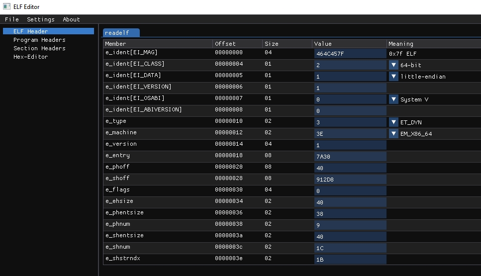
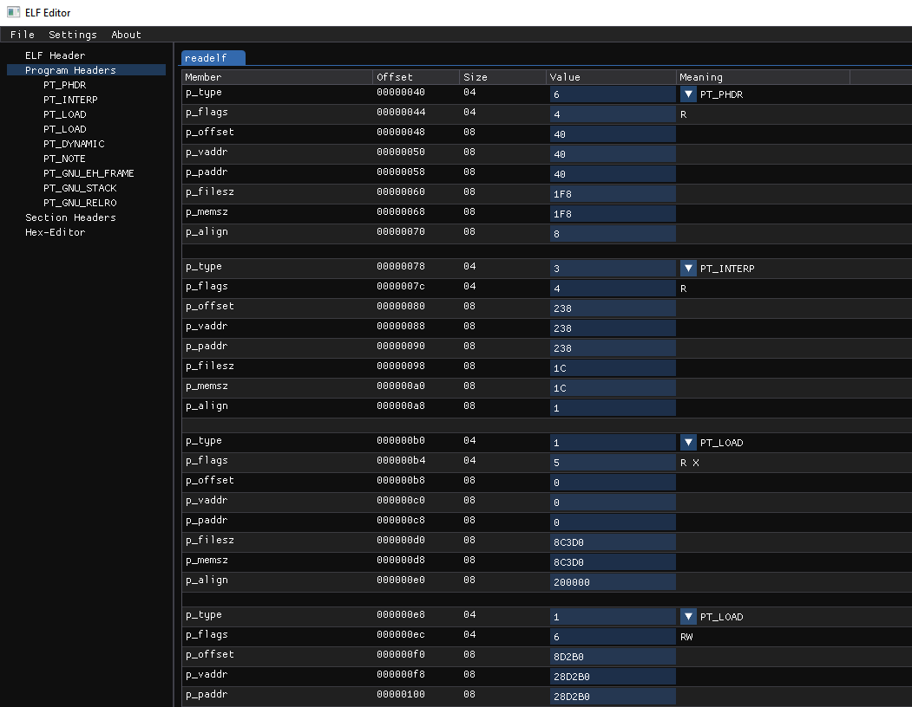
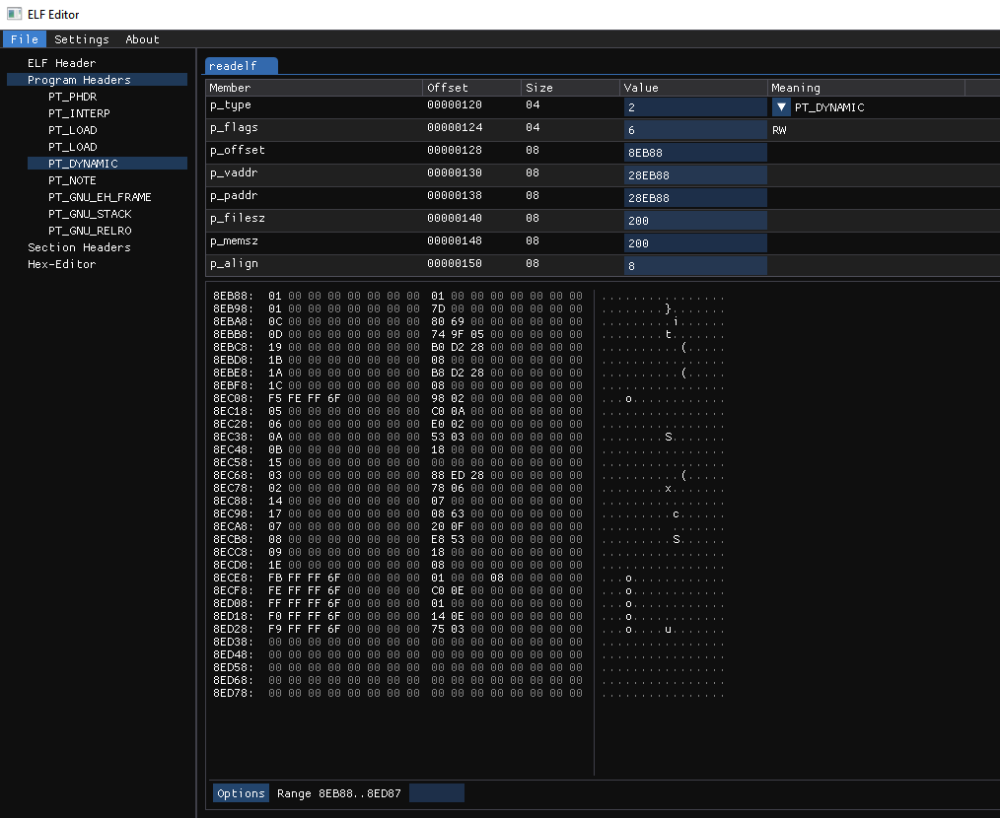
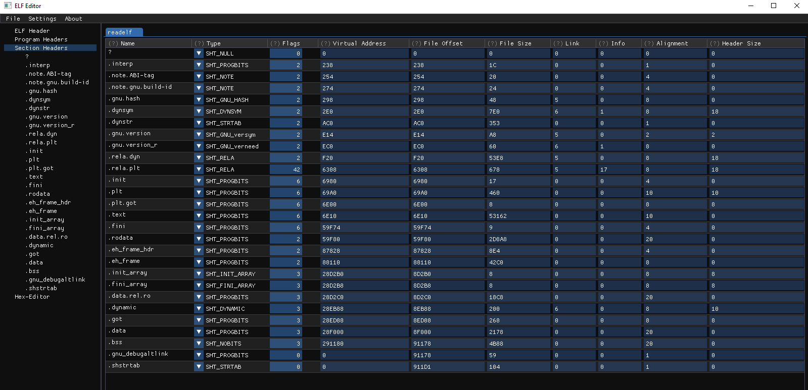
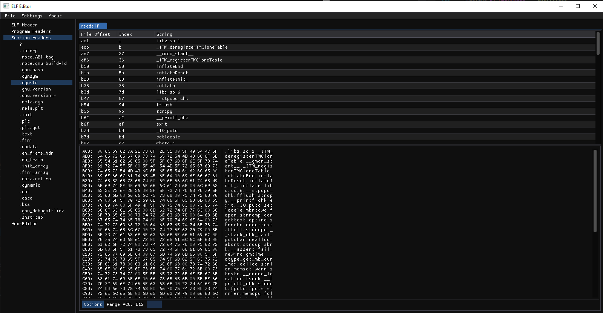

# ABANDONED PROJECT
I'm not happy with the code base. I used this project to learn more about the ELF file format. If I ever resume this work I will start from scratch, lessons were learned. I'm publishing a pre-release if anybody wants to give it a try. It only supports little-endian ELFs, best if they are x64.

# elfitor

elf editor

# Screenshots

### ELF Header

### Program Header

### PT_DYNAMIC

### Section headers

### Section .dynstr

> See more in the [assets](./assets/) directory